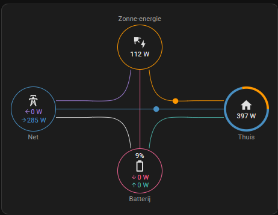

# home-assistant-modbus-ecactus-ecos

This configuration is based on [github repo for the blauhoff battery](https://github.com/driesk81/home-assistant-modbus-home-battery-blauhoff) adding registers for eCactus ECOS from [this post](https://community.home-assistant.io/t/interface-home-battery-blauhoff-or-ecactus-via-esphome-and-modbus/645345). Also i use an ESP32-S3 allowing it to fit into a small box.

The modbus controller has been rewritten so it can listen to commands from the Master on the modbus of the ECOS and at the same time request additional information.


## Let home assistant control your all in one home battery via modbus and esphome.

This yaml can be used to control ecactus-ecos systems.
The main purpose is to make the BMS (battery management system) available in Home Assistant to make automated charge/discharge possible. 
**Use at your own risk.**

## Installing ESPHome Manually
* ```python --version``` Should give the Python vesion 3.xx.x If no version is returned please install python
* ```pip3 install wheel```
* ```pip3 install esphome```
* ```esphome version``` should return Version: 202x.x.x.
* Edit the `secrets.yaml` by copying `secrets_example.yaml` and change it by reflecting your local settings
* ```esphome run ecactus.yaml``` on the first time you have to connect usb to pc. All other version can go over the air as long you are connected to same network 
 
# some remarks: 
* Make sure that your wifi credentials in the `secrets.yaml`.
* The yaml is tested on a esp32-s3 connected to a TTL to RS485 converter. You can use another esp32 but will need to change the yaml
* BMS settings can be selected in home assistant via list options and are pushed when [change modus] button is pressed.
* Known issue:  Component modbus_controller took a long time for an operation (0.05 s) and Components should block for at most 20-30ms i seen no effect or solution.

# hardware used:
   * ecactus-ecos
   * ESP32-S3
   * TTL to RS485 converter
   * container
   * some wire

# setup home assistant with: 
  * HACS
  * ESPHome
  * Power Flow Card

# setup 
  * Flash ESPHome to ESP32
  * Edit yaml on ESP32
 
 # Hardware setup
 
 

# lovelace setup

```
type: custom:power-flow-card
watt_threshold: 1000
entities:
  battery: sensor.yoursensorname_dsp_power
  battery_charge: sensor.yoursensorname_esp_v2_soc
  grid: sensor.yoursensorname_grid_power
  solar: sensor.yoursnesorname_pv_power
```
 

type: custom:power-flow-card
entities:
  battery: sensor.esp_ecactus_2_home_power
  battery_charge: sensor.sensor.esp_ecactus_soc
  grid: sensor.tibber_pulse_thuis_power
  solar: sensor.esp_ecactus_1_pv_power


# Research links

* (Use of resistor)[https://know.innon.com/bias-termination-rs485-network]

# TODO

* Fix issue reading multiple for addres = 2 while receiving

# Issue

* Still work in process, look at todo