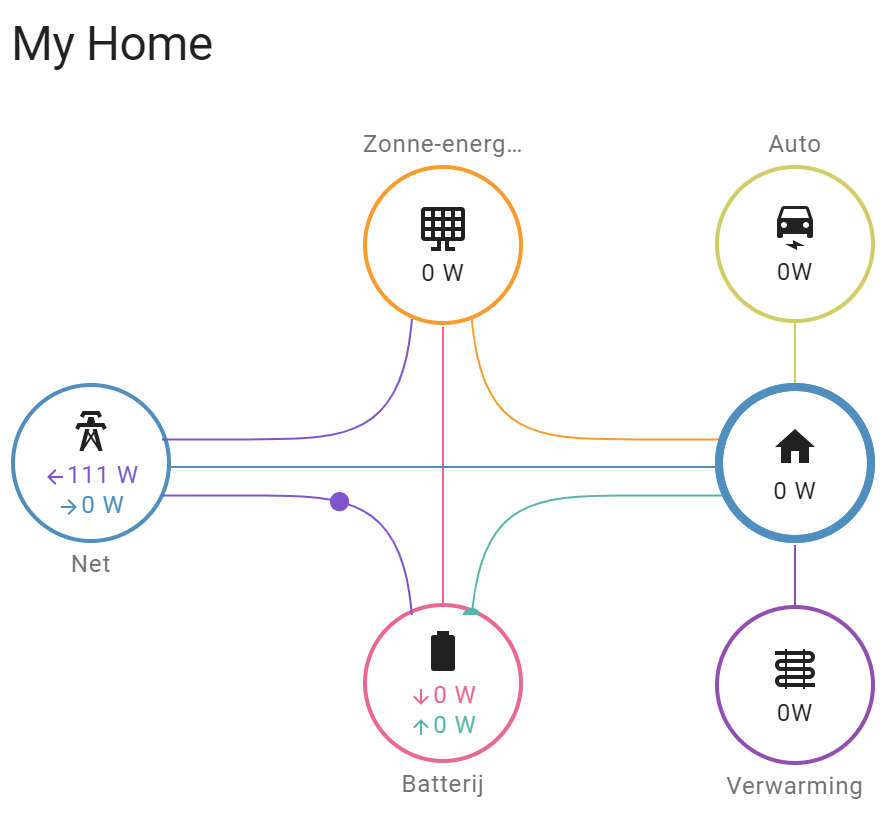

# Batty (eCactus-ecos-local) an ESPHome implementatation for the eCactus ecos battery inverter


This configuration is based on [github repo for the blauhoff battery](https://github.com/driesk81/home-assistant-modbus-home-battery-blauhoff) adding registers for eCactus ECOS from [this post](https://community.home-assistant.io/t/interface-home-battery-blauhoff-or-ecactus-via-esphome-and-modbus/645345). Also i use an ESP32-S3 allowing it to fit into a small box.

The modbus controller has been rewritten so it can listen to commands from the Master on the modbus of the ECOS and at the same time request additional information.

## Let home assistant control your all in one home battery via modbus and esphome.

This yaml can be used to control ecactus-ecos systems.
The main purpose is to make the BMS (battery management system) available in Home Assistant to make automated charge/discharge possible.

**Use at your own risk.**

## Installing ESPHome Manually

- `python --version` Should give the Python vesion 3.xx.x If no version is returned please install python
- `pip3 install wheel`
- `pip3 install esphome`
- `esphome version` should return Version: 202x.x.x.
- Edit the `secrets.yaml` by copying `secrets_example.yaml` and change it by reflecting your local settings
- `esphome run ecactus.yaml` on the first time you have to connect usb to pc. All other version can go over the air as long you are connected to same network

# some remarks:

- Make sure that your wifi credentials in the `secrets.yaml`, you can copy `secrets_example.yaml` to `secrets.yaml` and edit.
- The yaml is tested on a esp32-s3 connected to a TTL to RS485 converter. You can use another esp32 but will need to change the yaml
- BMS settings can be selected in home assistant via list options and are pushed when [change modus] button is pressed.
- Known issue: Component modbus_controller took a long time for an operation (0.05 s) and Components should block for at most 20-30ms i seen no effect or solution.

# hardware used:

- ecactus-ecos
- ESP32-S3
- TTL to RS485 converter
- some wire

# setup home assistant with:

- HACS
- ESPHome
- Power Flow Card

# Hardware setup


# lovelace setup

```
type: custom:power-flow-card-plus
entities:
  home:
    entity: sensor.esp_ecactus_home_power
  grid:
    entity:
      production: sensor.tibber_pulse_thuis_power_production
      consumption: sensor.tibber_pulse_thuis_power
  solar:
    icon: mdi:solar-panel-large
    entity: sensor.esp_ecactus_pv_power
  battery:
    icon: mdi:battery
    entity:
      consumption: sensor.battery_consumption
      production: sensor.battery_production
  individual:
    - entity: sensor.wallbox_pulsarplus_sn_347021_laadvermogen
      color_icon: false
      display_zero: true
      name: Auto
      icon: mdi:car-electric
    - entity: sensor.warmtepomp_vermogen
      color_icon: false
      display_zero: true
      name: Verwarming
      icon: mdi:heating-coil
w_decimals: 0
kw_decimals: 2
min_flow_rate: 0.9
max_flow_rate: 6
watt_threshold: 10000
clickable_entities: true
title: My Home
```



# Research links

- [Use of resistor](https://know.innon.com/bias-termination-rs485-network)

# TODO

- Make een functie in modbus process*modbus* die er voor zocht dat als de skip flag is gezet alle dat tot aan volgende server regel wordt gewist, de time out for resend wordt getriggerd, snifferque wordt gelegd

- Clear sniffers on error, preventing data is invalid
- Add support for P1 port, https://esphome.io/components/sensor/dsmr.html
- Add support for ecos meter port

- Port GP21 is led, blink on start

# Issue

- Still work in process, look at todo
